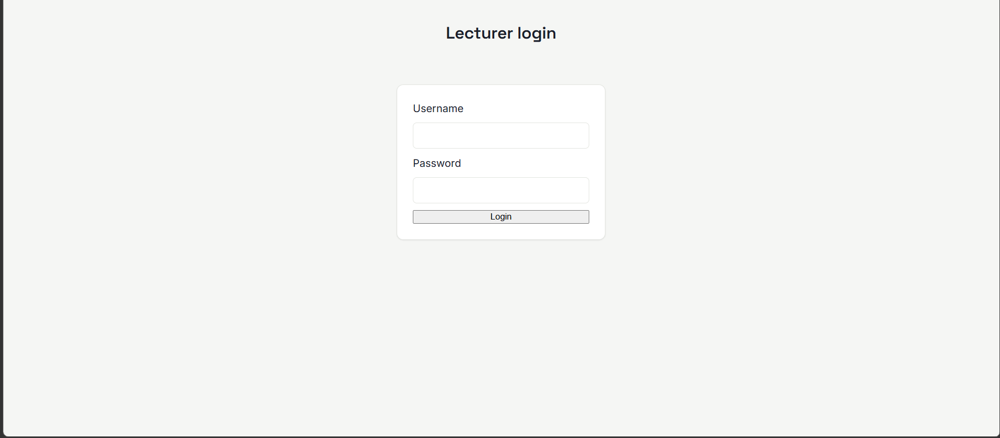
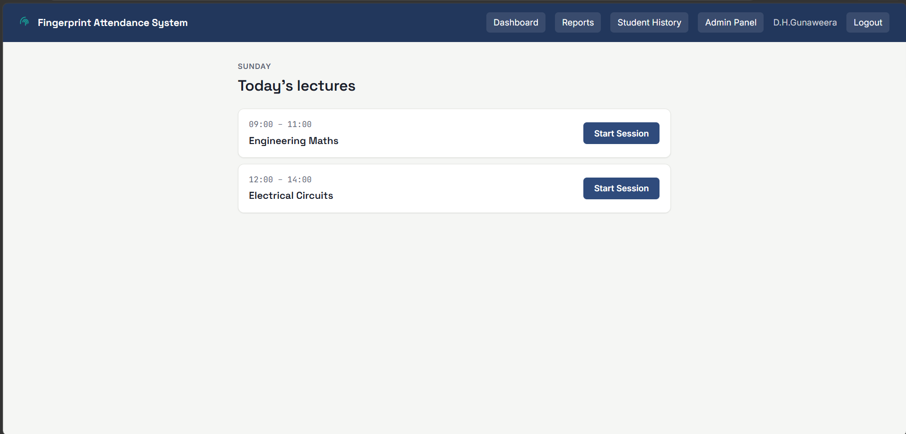
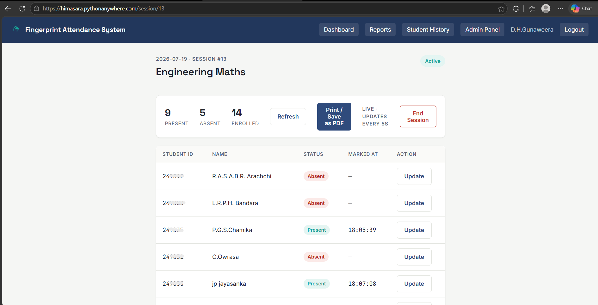
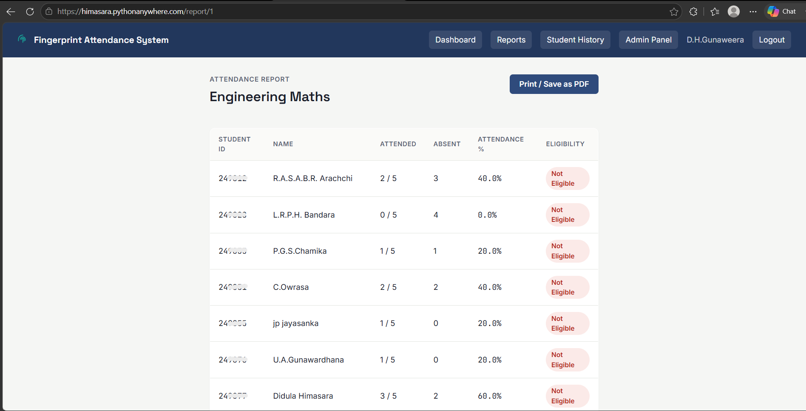

# Fingerprint-Based Student Attendance Management System

A fully working attendance system that uses a fingerprint sensor and an ESP32 microcontroller to automatically record student attendance in real time, integrated with a Flask web application and SQLite database. The project combines an **Embedded System** with a **Web Application** to reduce manual, error-prone attendance methods.

📦 **Repository:** [github.com/didulah/mini_project](https://github.com/didulah/mini_project)

> ✅ **Status:** Completed as a university mini project (ENAC 1X0, Wayamba University of Sri Lanka) — evaluated and passed.

---

## 📌 Why This Project (Motivation)

Traditional attendance marking methods (paper registers, roll calls, manual sign sheets) come with several problems this project solves:

- Reduces **proxy attendance (buddy punching)** — a fingerprint can't be shared
- Reduces lecture time spent on manually marking attendance
- Removes manual data-entry errors
- Maintains a **centralized, searchable** historical attendance record
- Automatically calculates **attendance percentage** and **80% eligibility status**

---

## 🛠️ Hardware Components

| Component                        | Purpose                                                         |
| -------------------------------- | --------------------------------------------------------------- |
| Fingerprint Sensor — R307S       | Captures and matches student fingerprints                       |
| ESP32 (38-pin)                   | Main controller — handles sensor, display, Wi-Fi, and API calls |
| RTC Module — DS3231 (HW-084)     | Provides accurate timestamps, independent of Wi-Fi/NTP          |
| OLED Display 0.91" (SSD1306, I2C)| Displays live system status and user feedback                   |
| Buzzer (via S8050 transistor)    | Audio confirmation for scan success/failure                     |
| Charging Module + 3.7V Battery   | Portable power supply                                           |

---

## 💻 Software Stack

- **Backend:** Flask (Python) — application factory pattern with Blueprints (`auth`, `attendance`, `api`, `admin`)
- **Database:** SQLite + SQLAlchemy ORM
- **Frontend:** HTML / CSS / JS (Jinja2 templates), custom design system (`style.css`)
- **Firmware:** Arduino / C++ (ESP32) — unified firmware supporting ATTENDANCE and ENROLLMENT modes
- **Deployment:** PythonAnywhere (Git-based deployment workflow, used during evaluation)

---

## ✨ Core Features

- ✅ Lecturer login (username/password) with role-based access
- ✅ Lecturer selects the day's timetable slot and starts an attendance session
- ✅ ESP32 → Flask API — real-time fingerprint-based attendance marking
- ✅ Live attendance view with auto-refresh during an active session
- ✅ End Session route to close out attendance taking
- ✅ Full attendance report for all students, with print-friendly export
- ✅ Student ID-based historical attendance report (monthly), showing:
  - Total lectures held
  - Number of absences
  - Attendance on a specific day
  - Attendance percentage and eligibility status (≥80% = eligible)
- ✅ **Update Attendance** — correct false-absent records, with a full audit trail
- ✅ **Update Attendance** — re-mark attendance for approved late excuses (medical, sports, other)
- ✅ Auto-enrollment of all students into all subjects (bidirectional)
- ✅ Local time display (UTC+5:30) throughout the app
- ✅ `DEMO_MODE` firmware flag for safe testing without affecting live timetable data
- ✅ Admin panel for student, lecturer, and timetable management
- ✅ Deployed on PythonAnywhere for evaluation

---

## 📁 Project Structure

```
mini_project/
├── app.py                 # Flask application factory
├── config.py              # App configuration
├── extensions.py          # Flask extensions (db, etc.)
├── models.py              # SQLAlchemy database models
├── requirements.txt
├── schema.sql             # Database schema reference
├── routes/                # Blueprints
│   ├── auth.py
│   ├── attendance.py
│   ├── api.py
│   └── admin.py
├── templates/             # Jinja2 HTML templates
├── static/
│   └── css/               # style.css design system
├── database/
│   └── attendance.db      # SQLite DB (gitignored, persistent on server)
├── firmware/              # ESP32 Arduino code
│   └── main.ino
├── PROJECT_LOG.md         # Running project context/decision log
└── README.md
```

---

## 🚀 Setup & Installation

```bash
git clone https://github.com/didulah/mini_project.git
cd mini_project
python -m venv venv
source venv/bin/activate      # Windows: venv\Scripts\activate
pip install -r requirements.txt
python init_db.py             # Creates the database and tables
python insert_timetable.py    # Loads timetable data
python app.py
```

The app will be available at `http://127.0.0.1:5000`.

### Firmware Setup

1. Open `firmware/main.ino` in Arduino IDE
2. Install required libraries: `Adafruit_Fingerprint`, `Adafruit SSD1306`, `ArduinoJson`, `RTClib`, `WiFiClientSecure`
3. Update Wi-Fi credentials and server URL in the firmware config
4. Flash to ESP32 and wire according to the hardware table above (OLED + RTC share I2C on GPIO21/22)

---

## 📸 Screenshots

| Login Page | Admin Dashboard |
|---|---|
|  |  |

| Live Attendance View | Student Report |
|---|---|
|  |  |

---

## 🔮 Possible Future Improvements

- Mobile-responsive admin dashboard

---

## 👤 Author

**Didula Gunaweera**
Undergraduate, Wayamba University of Sri Lanka
Contributed the full software side and the embedded firmware: Flask web application, database design, ESP32 firmware (Arduino/C++), and ESP32–server communication logic.

🔗 [LinkedIn](https://www.linkedin.com/in/didula-gunaweera-3aa7a1381)
🔗 [GitHub](https://github.com/didulah)

---

## 🙏 Acknowledgements

Developed as part of the ENAC 1X0 mini project module, Faculty of Technology, Wayamba University of Sri Lanka.
